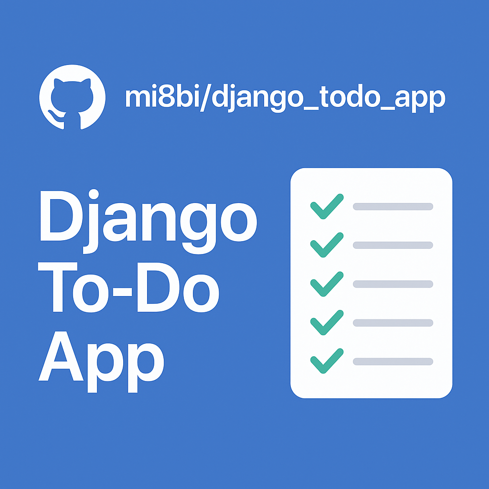
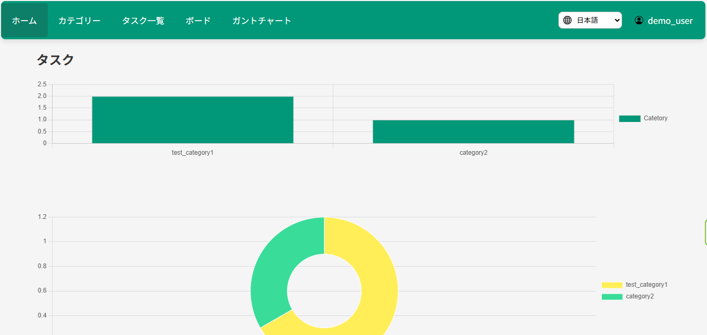
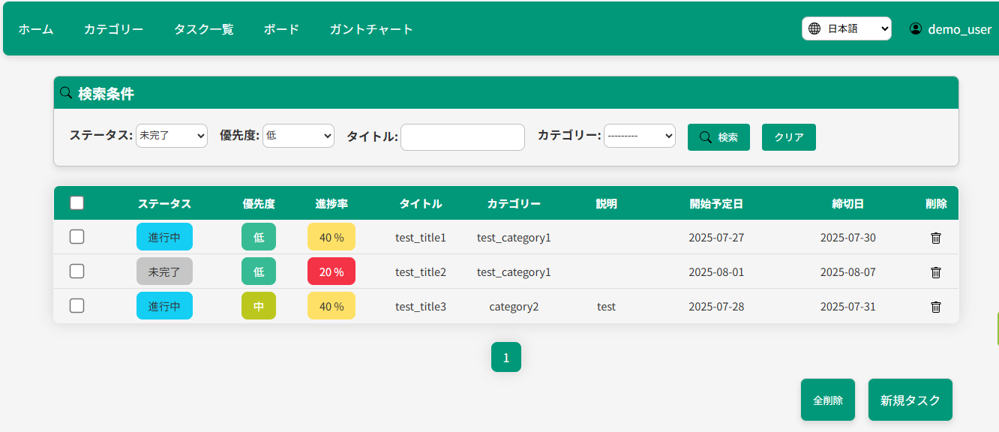
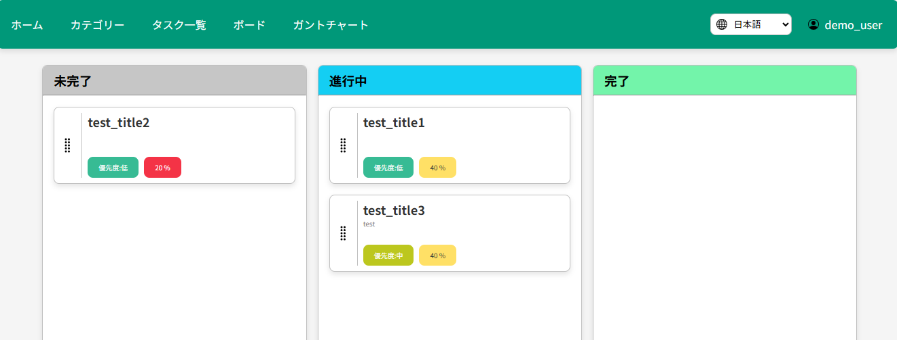
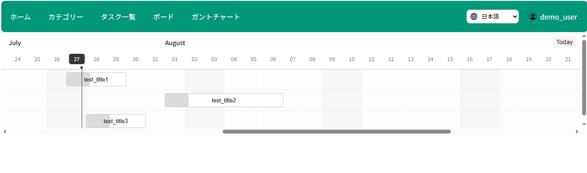

<p align="center">
  <a href="https://github.com/mi8bi/django_todo_app">
    
  </a>
</p>

# Django Todo App

A full-featured task management application built with Django, featuring user authentication, internationalization, and multiple project views including Kanban board and Gantt charts.

## 🚀 Live Demo

**[View Live Demo](https://django-todo-app-9250.onrender.com)**

### Demo Account
- **Username**: `demo_user`
- **Password**: `demo123456`

*Note: This is a shared demo account. Please be respectful and avoid deleting other users' demo data.*

## 📸 Screenshots

### Dashboard

*Analytics dashboard showing task distribution and progress overview*

### Task List View

*Comprehensive task management with sorting, filtering, and bulk operations*

### Kanban Board

*Drag-and-drop task management across different status columns*

### Gantt Chart

*Timeline visualization for project planning and tracking*

## ✨ Features

### Core Functionality
- **User Authentication**: Registration with email verification, login/logout
- **Task Management**: Create, read, update, delete tasks with detailed information
- **Category Management**: Organize tasks with custom categories
- **Progress Tracking**: Monitor task completion with percentage-based progress

### Advanced Features
- **Multiple Views**: 
  - List view with sorting and pagination
  - Kanban board with drag-and-drop functionality
  - Gantt chart for timeline visualization
  - Dashboard with analytics charts
- **Search & Filter**: Advanced filtering by status, priority, category, and title
- **Bulk Operations**: Delete multiple tasks at once
- **Internationalization**: Support for English and Japanese languages
- **Email Verification**: Secure account activation via email

### Task Properties
- Title and description
- Start date and due date
- Priority levels (Low, Medium, High)
- Status tracking (Not Completed, In Progress, Completed)
- Progress percentage (0-100%)
- Category assignment

## 🛠️ Technology Stack

- **Backend**: Django 5.2+
- **Database**: SQLite (development), easily configurable for PostgreSQL/MySQL
- **Frontend**: HTML5, CSS3, JavaScript
- **Charts**: Chart.js for analytics visualization
- **Gantt Charts**: Frappe Gantt library
- **Drag & Drop**: SortableJS for Kanban board
- **Email**: Django's email backend with Gmail SMTP support
- **Deployment**: Render.com ready with Gunicorn + WhiteNoise

## 🔧 Installation

### Prerequisites
- Python 3.12+
- pip (Python package manager)
- Git

### Local Development Setup

1. **Clone the repository**
   ```bash
   git clone https://github.com/mi8bi/django_todo_app.git
   cd django_todo_app
   ```

2. **Create virtual environment**
   ```bash
   python -m venv venv
   
   # On Windows
   venv\Scripts\activate
   
   # On macOS/Linux
   source venv/bin/activate
   ```

3. **Install dependencies**
   ```bash
   pip install -r requirements.txt
   ```

4. **Environment Configuration**
   Create a `.env` file in the project root:
   ```bash
   SECRET_KEY=your-secret-key-here
   EMAIL_HOST_USER=your-gmail@gmail.com
   EMAIL_HOST_PASSWORD=your-app-password
   EMAIL_VERIFICATION_SALT=your-email-salt
   ```

5. **Database Setup**
   ```bash
   cd todo_app
   python manage.py makemigrations
   python manage.py migrate
   ```

6. **Create Superuser (Optional)**
   ```bash
   python manage.py createsuperuser
   ```

7. **Compile Messages for Internationalization**
   ```bash
   python manage.py compilemessages
   ```

8. **Run Development Server**
   ```bash
   python manage.py runserver
   ```

## 🎯 Quick Start Guide

### 1️⃣ Try the Demo
Visit the [live demo](https://django-todo-app-9250.onrender.com) and login with:
- Username: `demo_user`
- Password: `demo123456`

### 2️⃣ One-Click Setup (Recommended)
```bash
# Clone and setup in one command
git clone https://github.com/mi8bi/django_todo_app.git && cd django_todo_app && python -m venv venv && source venv/bin/activate && pip install -r requirements.txt && cd todo_app && python manage.py migrate && python manage.py runserver
```

### 3️⃣ Docker Setup (Alternative)
```bash
docker build -t django-todo-app . && docker run -p 8000:8000 django-todo-app
```

Visit `http://127.0.0.1:8000` and start managing your tasks!

### Docker Development Setup

1. **Using Docker Compose (if available)**
   ```bash
   docker-compose up --build
   ```

2. **Using Dockerfile directly**
   ```bash
   docker build -t django-todo-app .
   docker run -p 8000:8000 django-todo-app
   ```

### VS Code Development Container

The project includes a complete development container setup:

1. Install the "Dev Containers" extension in VS Code
2. Open the project in VS Code
3. Press `Ctrl+Shift+P` and select "Dev Containers: Reopen in Container"
4. The container will automatically set up the development environment

## ⚙️ Configuration

### Email Settings

For user registration with email verification, configure Gmail SMTP:

1. Enable 2-factor authentication on your Gmail account
2. Generate an App Password for Django
3. Set environment variables:
   ```bash
   EMAIL_HOST_USER=your-gmail@gmail.com
   EMAIL_HOST_PASSWORD=your-16-character-app-password
   ```

### Environment Variables

| Variable | Description | Default |
|----------|-------------|---------|
| `SECRET_KEY` | Django secret key (required) | None |
| `DEBUG` | Debug mode | `True` (development) |
| `EMAIL_HOST_USER` | Gmail username for SMTP | None |
| `EMAIL_HOST_PASSWORD` | Gmail app password | None |
| `EMAIL_VERIFICATION_SALT` | Salt for email tokens | `email-verification-salt` |
| `RENDER` | Production flag for Render.com | `false` |

## 📖 Usage

### Getting Started

1. **Register an Account**
   - Navigate to the signup page
   - Fill in username, email, and password
   - Check your email for verification link
   - Click the verification link to activate your account

2. **Login**
   - Use your username and password to log in
   - You'll be redirected to the dashboard

3. **Create Categories** (Optional)
   - Go to Categories page
   - Add categories to organize your tasks

4. **Create Tasks**
   - Click "New Task" from the task list
   - Fill in task details (title, category, dates, etc.)
   - Save the task

### Key Features Usage

**Dashboard**: View analytics and overview of your tasks

**Task List**: 
- Sort by clicking column headers
- Filter using the search form
- Select multiple tasks for bulk deletion
- Click on any task row to edit

**Kanban Board**:
- Drag tasks between columns (Not Completed, In Progress, Completed)
- Click on task cards to edit details

**Gantt Chart**:
- Visual timeline of all your tasks
- See task dependencies and duration

**Categories**:
- Create, edit, and delete task categories
- Organize tasks by project or type

## 🚀 Deployment

### Render.com Deployment

The project is configured for easy deployment on Render.com:

1. **Connect Repository**
   - Link your GitHub repository to Render
   - Use the provided `render.yaml` configuration

2. **Environment Variables**
   Set the following in Render dashboard:
   ```
   SECRET_KEY=your-production-secret-key
   EMAIL_HOST_USER=your-gmail@gmail.com
   EMAIL_HOST_PASSWORD=your-app-password
   RENDER=true
   ```

3. **Database**
   - SQLite is used by default
   - For production, consider PostgreSQL addon

### Manual Production Deployment

1. **Collect Static Files**
   ```bash
   python manage.py collectstatic --noinput
   ```

2. **Compile Messages**
   ```bash
   python manage.py compilemessages
   ```

3. **Run with Gunicorn**
   ```bash
   gunicorn todo_app.wsgi:application --bind 0.0.0.0:8000
   ```

## 📁 Project Structure

```
django_todo_app/
├── .devcontainer/          # VS Code dev container config
├── todo_app/               # Main Django project
│   ├── accounts/           # User authentication app
│   │   ├── templates/      # Auth templates
│   │   ├── static/         # Auth static files
│   │   └── ...
│   ├── todos/              # Task management app
│   │   ├── templates/      # Task templates
│   │   ├── static/         # Task static files
│   │   ├── migrations/     # Database migrations
│   │   └── ...
│   ├── templates/          # Global templates
│   └── todo_app/           # Project settings
├── requirements.txt        # Python dependencies
├── Dockerfile             # Development container
├── Dockerfile.prod        # Production container
└── render.yaml           # Render.com deployment config
```

## 🤝 Contributing

1. Fork the repository
2. Create a feature branch (`git checkout -b feature/amazing-feature`)
3. Commit your changes (`git commit -m 'Add some amazing feature'`)
4. Push to the branch (`git push origin feature/amazing-feature`)
5. Open a Pull Request

### Development Guidelines

- Follow PEP 8 style guidelines
- Use Black formatter for code formatting
- Run Flake8 for linting
- Write tests for new features
- Update documentation as needed

## 🧪 Testing

Run the test suite:
```bash
python manage.py test
```

For coverage reporting:
```bash
pip install coverage
coverage run --source='.' manage.py test
coverage report
coverage html  # Generate HTML coverage report
```

## 🌐 Internationalization

The app supports multiple languages:

- **English** (en)
- **Japanese** (ja)

To add a new language:

1. Add language to `LANGUAGES` in settings.py
2. Create message files: `python manage.py makemessages -l <language_code>`
3. Translate strings in the `.po` files
4. Compile messages: `python manage.py compilemessages`

## 📄 License

This project is open source and available under the [MIT License](LICENSE).

---

<div align="center">

**⭐ If you found this project helpful, please give it a star! ⭐**

Made with ❤️ by [mi8bi](https://github.com/mi8bi)

[Demo](https://django-todo-app-9250.onrender.com) • [Report Bug](https://github.com/mi8bi/django_todo_app/issues) • [Request Feature](https://github.com/mi8bi/django_todo_app/issues)

</div>